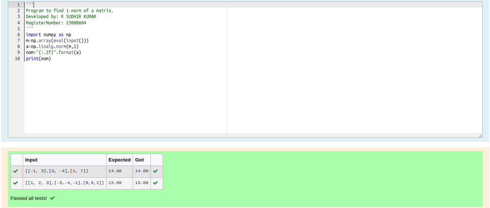
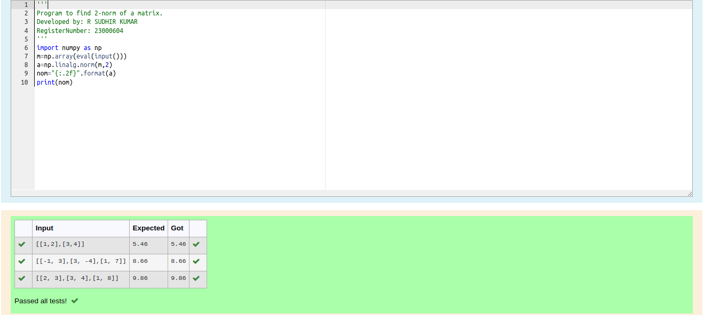
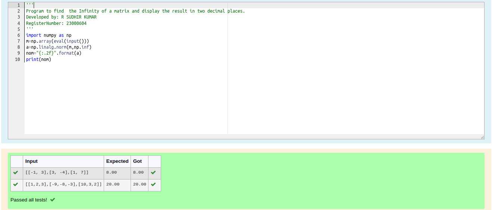

# Norm of a matrix
## Aim
To write a program to find the 1-norm, 2-norm and infinity norm of the matrix and display the result in two decimal places.
## Equipment’s required:
1.	Hardware – PCs
2.	Anaconda – Python 3.7 Installation / Moodle-Code Runner
## Algorithm:
	1. Get the input matrix using np.array()   
    2. Find the 2-norm of the matrix using np.linalg.norm()
	3. Print the norm of the matrix in two decimal places.
## Program:
```Python
## 1-Norm of a Matrix
'''
Program to find 1-norm of a matrix.
Developed by: R SUDHIR KUMAR
RegisterNumber: 23000604
'''
import numpy as np
m=np.array(eval(input()))
a=np.linalg.norm(m,1)
nom="{:.2f}".format(a)
print(nom)

## 2-Norm of a Matrix
'''
Program to find 2-norm of a matrix.
Developed by: R SUDHIR KUMAR
RegisterNumber: 23000604
'''
import numpy as np
m=np.array(eval(input()))
a=np.linalg.norm(m,2)
nom="{:.2f}".format(a)
print(nom)

## Infinity Norm of a Matrix
'''
Program to find  the Infinity of a matrix and display the result in two decimal places.
Developed by: R SUDHIR KUMAR
RegisterNumber: 23000604
'''
import numpy as np
m=np.array(eval(input()))
a=np.linalg.norm(m,np.inf)
nom="{:.2f}".format(a)
print(nom)

```
## Output:
## 1-Norm of a Matrix


## 2-Norm of a Matrix



## 3-Infinity Norm of a Matrix


## Result
Thus the program for 1-norm, 2-norm and Infinity norm of a matrix are written and verified.
